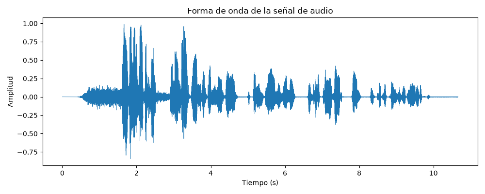
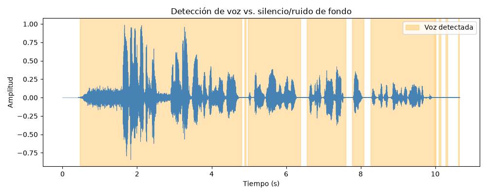
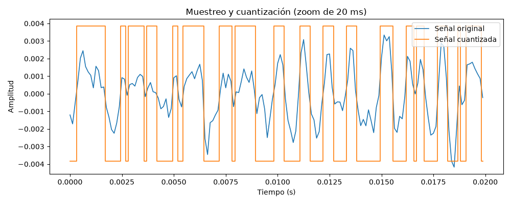
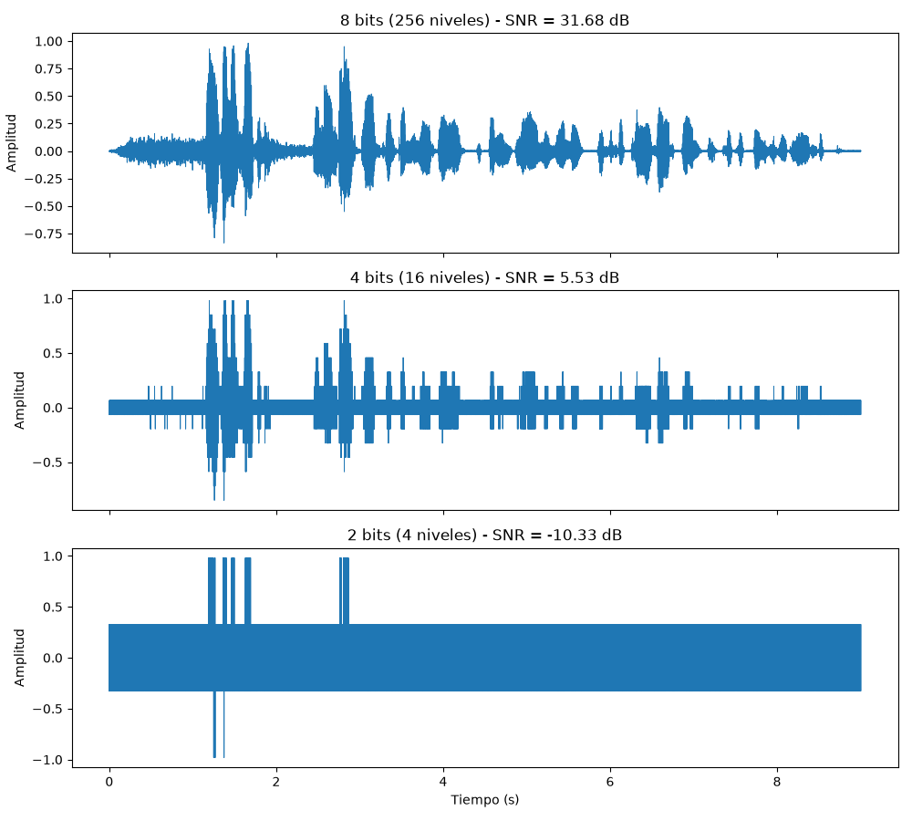
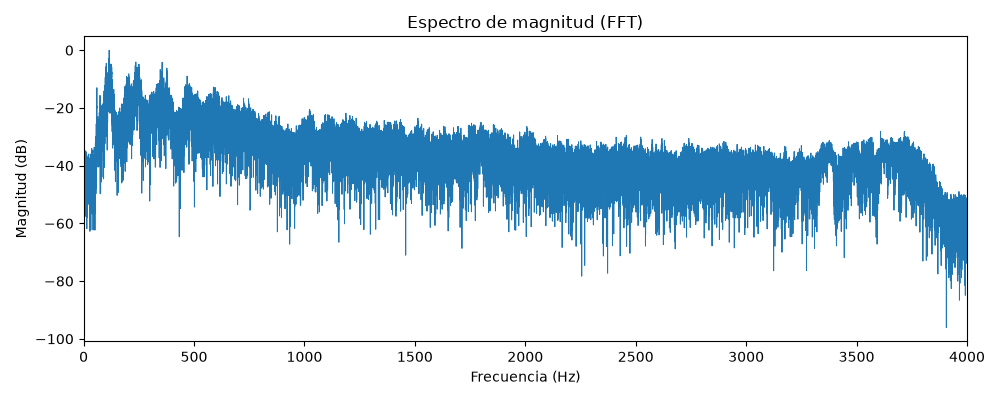
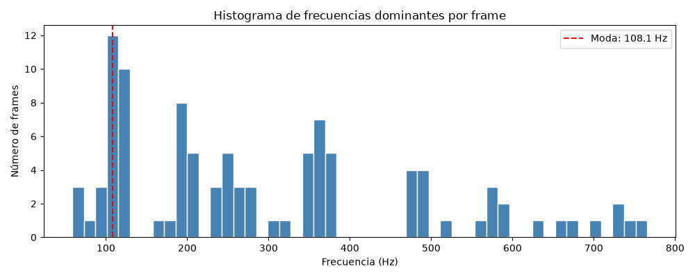

# Informe de Proyecto: Procesamiento Digital de una Señal de Voz

**Curso:** Python for Research – Módulo 2, Proyecto 2 (Audio Processing)
**Universidad:** Universidad Católica de Oriente
**Integrantes:** Juan Camilo Urrea, Felipe Mosquera

---

## 1. Introducción

El procesamiento digital de señales de audio permite transformar una señal analógica —como la voz humana— en una representación discreta que puede ser almacenada, transmitida y analizada computacionalmente. Este proyecto aplica los conceptos fundamentales del procesamiento de audio (muestreo, cuantización, codificación y análisis en frecuencia) sobre una grabación de voz real, con el fin de ilustrar de forma práctica el flujo completo desde una señal cruda hasta la identificación de sus características espectrales.

La grabación utilizada corresponde a una nota de voz en formato OGG, con ruido de fondo presente, lo cual añadió un reto adicional y realista al proyecto: el diseño de un filtrado de silencios que no dependiera de un umbral fijo arbitrario, sino que se adaptara al nivel de ruido detectado en la señal.

## 2. Objetivo

Desarrollar una aplicación en Python capaz de procesar una señal de voz, filtrar sus intervalos de silencio, aplicar muestreo, cuantización y codificación, y analizar la señal resultante mediante la Transformada de Fourier, con el fin de identificar la frecuencia dominante y el rango de frecuencias de la voz grabada.

## 3. Metodología

### 3.1 Adquisición y formato del audio

El audio de entrada es una grabación de voz pregrabada en formato **OGG** (nota de voz), con ruido de fondo audible. Dado que `librosa`/`soundfile` soportan Ogg Vorbis de forma nativa (a través de `libsndfile`), el archivo se carga directamente sin necesidad de conversión externa; internamente se normaliza a formato WAV sin pérdida antes de continuar el pipeline, para evitar artefactos de compresión en el análisis espectral posterior.

- Sample rate original de la grabación: **48 000 Hz**

### 3.2 Filtrado de intervalos de silencio

Debido al ruido de fondo presente en la grabación, un umbral fijo de silencio no era adecuado: dejaría pasar ruido como si fuera voz, o recortaría voz de baja energía. Se implementó un umbral **adaptativo**:

1. Se estima el piso de ruido dividiendo la señal en frames de 20 ms, calculando el RMS de cada uno y tomando el percentil 10 de esos valores como referencia del ruido de fondo.
2. El umbral de silencio (`top_db` de `librosa.effects.split`) se calcula como el piso de ruido más un margen de 10 dB, acotado entre 10 y 90 dB.
3. Los tramos detectados como voz se concatenan en una señal limpia; los tramos de silencio se descartan.

El pipeline reportó una duración original de 10.660 s y una duración tras remover silencios de 9.003 s, lo que equivale a un **15.5% del audio original** removido como silencio/ruido de fondo (umbral adaptativo `top_db` = 50.89 dB).

### 3.3 Muestreo, cuantización y codificación

- La señal limpia se remuestrea de 48 000 Hz a **8 000 Hz**, suficiente según el teorema de Nyquist para capturar el fundamental de la voz humana (hasta ~4 000 Hz de Nyquist), reduciendo el volumen de datos sin perder información relevante para el habla.
- Se cuantiza a **8 bits** (256 niveles), el estándar de referencia en PCM de voz.
- Cada muestra cuantizada se codifica en su representación binaria de 8 bits (PCM).

Para evaluar el efecto de la profundidad de bits sobre la calidad, se comparó adicionalmente la cuantización a 8, 4 y 2 bits, midiendo en cada caso la relación señal-ruido de cuantización (SNR).

### 3.4 Análisis en el dominio de la frecuencia

Sobre la señal remuestreada y cuantizada se calculó:

- La **FFT** de un solo lado (`scipy.fft.rfft`) sobre la señal completa, para obtener el espectro de magnitud global.
- El **STFT** (`librosa.stft`) por frames, para obtener la frecuencia dominante en cada frame y así construir un histograma de frecuencias dominantes (más robusto frente a variaciones de la voz en el tiempo que una única FFT global).
- La frecuencia dominante global se estimó de dos formas independientes: el pico del espectro promedio y la moda del histograma de frecuencias dominantes por frame.
- El rango de frecuencias efectivo se determinó identificando la banda donde la magnitud del espectro supera un umbral de -20 dB relativo al pico.

## 4. Proceso de desarrollo

El proyecto se desarrolló con una metodología de **vibe coding**: la lógica, arquitectura y justificación técnica de cada módulo se definieron explícitamente en prompts detallados, y la implementación del código se generó con **Claude Code** a partir de dichos prompts, con revisión y prueba manual después de cada etapa. El pipeline se construyó de forma incremental y modular:

```
audio-processing-project/
├── audio/                        # audio original, limpio y cuantizado
├── figures/                      # 6 figuras generadas por el pipeline
├── docs/
│   └── CODE_EXPLANATION.md       # documentación técnica detallada
├── src/
│   ├── load_and_inspect.py       # carga e inspección de la señal
│   ├── format_utils.py           # conversión de formatos a WAV
│   ├── preprocess.py             # filtrado adaptativo de silencios
│   ├── sampling_quant_code.py    # muestreo, cuantización y codificación PCM
│   ├── fourier_analysis.py       # FFT, STFT, frecuencia dominante y rango
│   └── main.py                   # orquestador end-to-end
├── requirements.txt
└── README.md
```

Cada módulo se probó de forma individual antes de integrarse en `main.py`, que ejecuta el pipeline completo de punta a punta a partir del audio crudo y genera automáticamente las 6 figuras junto con un resumen numérico consolidado.

## 5. Resultados

| Etapa | Figura | Descripción |
|---|---|---|
| Señal cruda | `figures/01_raw_waveform.png` | Forma de onda original en el dominio del tiempo |
| Filtrado de silencios | `figures/02_silence_removal.png` | Regiones de voz detectadas sobre la señal original |
| Muestreo/cuantización | `figures/03_sampling_quantization.png` | Zoom comparando señal original vs. cuantizada |
| Comparación de bits | `figures/04_bit_depth_comparison.png` | Degradación de la señal a 8, 4 y 2 bits |
| Espectro de frecuencia | `figures/05_frequency_spectrum.png` | Magnitud (dB) vs. frecuencia |
| Histograma de frecuencias | `figures/06_frequency_histogram.png` | Frecuencias dominantes por frame |








*(Estas rutas son relativas: coloca este informe en la raíz del proyecto, junto a la carpeta `figures/`, para que las imágenes se muestren automáticamente al abrirlo en VS Code, GitHub o cualquier visor de Markdown.)*

**Resultados numéricos:**

| Parámetro | Valor |
|---|---|
| Sample rate original | 48 000 Hz |
| Sample rate final | 8 000 Hz |
| Profundidad de cuantización | 8 bits (256 niveles) |
| SNR de cuantización (8 bits) | 31.68 dB |
| SNR de cuantización (4 bits) | 5.53 dB |
| SNR de cuantización (2 bits) | -10.33 dB |
| Bitrate resultante | 64 000 bits/s (64 kbps) |
| Frecuencia fundamental estimada | ~108–116 Hz |
| Rango de frecuencia con energía significativa | ~59–757 Hz |

## 6. Discusión

Los resultados obtenidos son consistentes con lo esperado para una señal de voz humana. La frecuencia fundamental estimada (~108–116 Hz) se ubica en el rango típico de voz masculina (85–180 Hz), y el rango de energía significativa detectado (~59–757 Hz) es coherente con el ancho de banda de un canal de voz, capturando el fundamental y los primeros armónicos/formantes relevantes.

La comparación de profundidad de bits evidencia claramente el compromiso entre calidad y tamaño de datos: el SNR cae de 31.68 dB (8 bits, calidad aceptable) a 5.53 dB (4 bits, degradación notoria) y hasta -10.33 dB (2 bits, la señal queda dominada por el ruido de cuantización). Esto ilustra por qué 8 bits es un estándar mínimo razonable para voz inteligible, aunque los sistemas de telefonía digital modernos suelen usar compresión logarítmica (μ-law/A-law) en vez de cuantización lineal uniforme para mejorar el SNR percibido a igual número de bits.

El principal reto metodológico fue el ruido de fondo presente en la grabación, que impedía usar un umbral de silencio fijo. El umbral adaptativo basado en el piso de ruido resolvió esto de forma más robusta, aunque no es perfecto: en tramos donde el ruido de fondo tiene una energía comparable a la voz de baja intensidad, es posible que pequeños fragmentos de ruido se conserven como si fueran voz, o que fragmentos de voz muy suave se descarten como silencio.

El límite de Nyquist impuesto por el remuestreo a 8 000 Hz (4 000 Hz máximo representable) es suficiente para el fundamental de la voz, pero recorta armónicos superiores de los formantes que sí están presentes en la grabación original a 48 000 Hz. Esto es una limitación aceptada conscientemente, dado que el objetivo del proyecto es identificar la frecuencia fundamental y el rango dominante, no una reproducción de alta fidelidad.

Según lo impreso por el pipeline, los dos métodos de estimación de frecuencia dominante arrojaron valores cercanos: 115.7 Hz (pico del espectro global) y 108.1 Hz (moda del histograma por frame). El pipeline no emitió la advertencia de diferencia significativa (que se activa cuando la diferencia relativa supera el 20%), por lo que ambos métodos se consideran consistentes entre sí.

## 7. Conclusiones

- Se implementó exitosamente un pipeline completo de procesamiento de voz: filtrado de silencios, muestreo, cuantización, codificación PCM y análisis espectral mediante FFT/STFT.
- El umbral adaptativo de silencio basado en el piso de ruido resultó más robusto que un umbral fijo frente a una grabación con ruido de fondo real.
- La frecuencia fundamental identificada (~108–116 Hz) y el rango de frecuencia detectado (~59–757 Hz) son consistentes con las características típicas de la voz humana.
- La comparación de profundidades de bits confirma el compromiso fundamental entre calidad de la señal (SNR) y tasa de bits en sistemas de codificación PCM.
- El proyecto evidencia de forma práctica el flujo completo de una cadena de procesamiento digital de señales, desde la señal analógica hasta su caracterización en el dominio de la frecuencia.

## 8. Referencias

- Christensen, M. G. (2019). *Introduction to audio processing*. Springer.
- Müller, M. (2021). *Fundamentals of music processing: Using Python and Jupyter notebooks* (Vol. 2). Springer.
- Zölzer, U. (2022). *Digital audio signal processing*. John Wiley & Sons.
- McFee, B., et al. *librosa: Audio and Music Signal Analysis in Python*. Documentación oficial: https://librosa.org
- Virtanen, P., et al. *SciPy 1.0: Fundamental Algorithms for Scientific Computing in Python*. Documentación oficial: https://scipy.org

## Anexos

- **Audio utilizado:** `audio/WhatsApp Ptt 2026-09-13 at 11.09.41 AM.ogg` — incluido en la carpeta del proyecto. **[COMPLETAR: agregar aquí un link de descarga si se sube a un repositorio externo]**
- **Código fuente completo:** ver carpeta `src/` del proyecto adjunto, y documentación técnica en `docs/CODE_EXPLANATION.md`. **[COMPLETAR: link al repositorio de GitHub, si aplica]**
- **Video explicativo:** **[COMPLETAR: link o código QR del video]**

### Nota sobre herramientas utilizadas

El desarrollo del código se realizó utilizando **Claude Code** (Anthropic) como asistente de programación mediante la técnica de *vibe coding*: la arquitectura, decisiones metodológicas y especificaciones de cada módulo fueron definidas y dirigidas por los autores del proyecto, mientras que la herramienta de IA generó la implementación en Python a partir de esas especificaciones, la cual fue revisada y probada en cada etapa.
